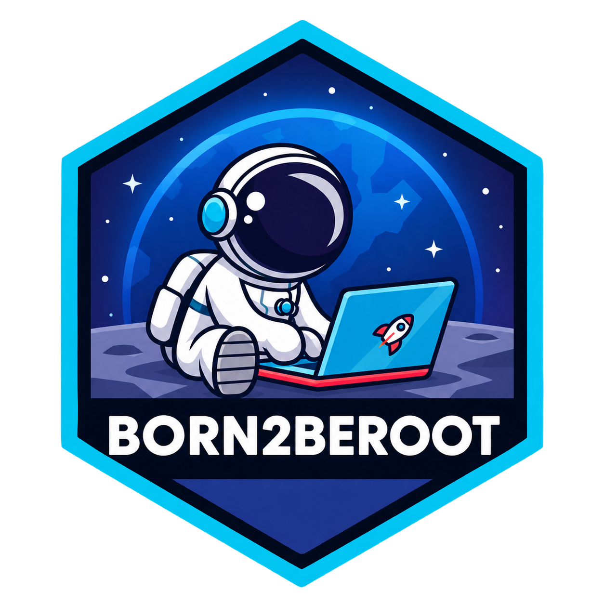

*This project has been created as part of the 42 curriculum by iualkhim*

  

## Description

The main goal of the **Born2beroot** project
is to create and configure a **Linux (Debian)** environment inside a **VirtualBox** virtual machine.

The system is build from scratch to explore the fundamentals of **system administration**, **security** and **server management**.

The main topics covered are ***users and groups, permissions, `sudo`, SSH, password policies, disk partitioning, encrypted volumes, LVM, firewall configuration and system monitoring***.

The bonus part includes the following additional services:

- **WordPress** — Lighttpd, PHP and MariaDB.
- **Docker** — containerization.
- **n8n** — self-hosted workflow automation.

The repository contains the configuration scripts used during the project and documentation covering the system configuration, the purpose of its components and the concepts behind them.

| Documentation| Description |
| ----- | ------|
|[System Installation](./docs/system_install.md)| - virtual machine setup and Debian installation |
|[System Configuration](./docs/system_config.md)| - users, groups, sudo, SSH, password policy and firewall |
|[Monitoring](./docs/monitoring.md)| - system [monitoring script](./monitoring.sh)  and cron configuration |
|[WordPress](./docs/wordpress.md)| - WordPress setup with Lighttpd, PHP and MariaDB |
|[n8n](./docs/n8n.md)| - Docker and n8n setup and configuration |

## Instructions
## Resources
